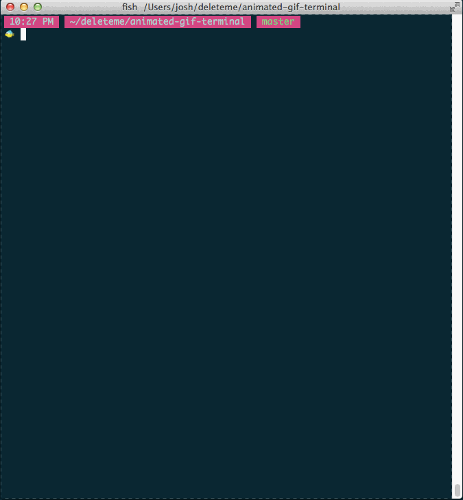

Animated Gifs In The Terminal
=============================

What?
-----



Try
---

```sh
$ curl -sL http://bit.ly/1DRCK7q | ruby -
```

Install
-------

```sh
$ brew install imagemagick               # C dependency for reading gifs
$ bundle                                 # Get the Ruby dependencies
$ rspec                                  # Run the tests
$ bin/gif2rb examples/nyan.gif | ruby -  # Run the binary
```

Run
---

```sh
# see all options
$ bin/gif2rb -h

# run the owl
$ bin/gif2rb examples/owl.gif | ruby -

# run the kitten with highest quality pixels
$ bin/gif2rb examples/kitten.gif -s sharp | ruby -
```

ImageMagick
-----------

```sh
# Turn the white bg to transparent
convert pony.gif -alpha set -channel RGBA -fuzz '20%' -fill none -floodfill +0+0 black pony2.gif

# Crop the unused space (WxH+X+Y)
convert pony.gif -crop 88x80+34+40 pony4.gif

# Trim bounds (didn't work)
# convert anim_bgnd.gif -layers TrimBounds anim_trim_bounds.gif

# Extract frames from the animation
# convert pony.gif -scene 1 +adjoin frame_%03d.gif

# Okay, in the end, this is what I actually went with
convert pony.gif -crop 88x80+34+40 +repage -scale 50% pony4.gif

# Fixing disposal and alpha for pacman, scaling down, cropping the border (still doing this by trial and error >.<
$ convert -dispose Previous pacman.gif \
          -alpha set                   \
          -channel RGBA                \
          -fuzz '20%'                  \
          -fill none                   \
          -floodfill +0+0 black        \
          -scale 20%                   \
          -crop 100%x25+0+25 +repage   \
          pacman3.gif

# deleting frames we don't want
$ convert examples/nyan.gif -delete 5-8 -scale 11% examples/nyan.gif
```


Steal
-----

[wtfpl](http://www.wtfpl.net/about/).
